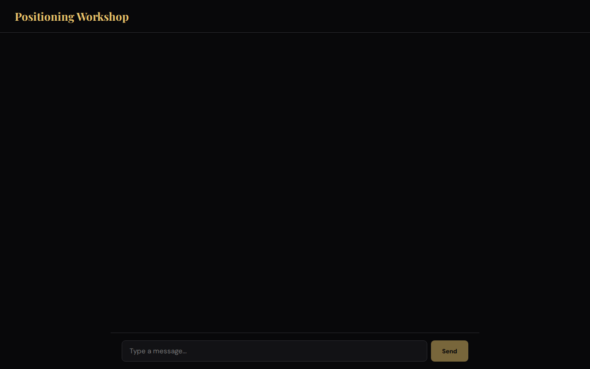
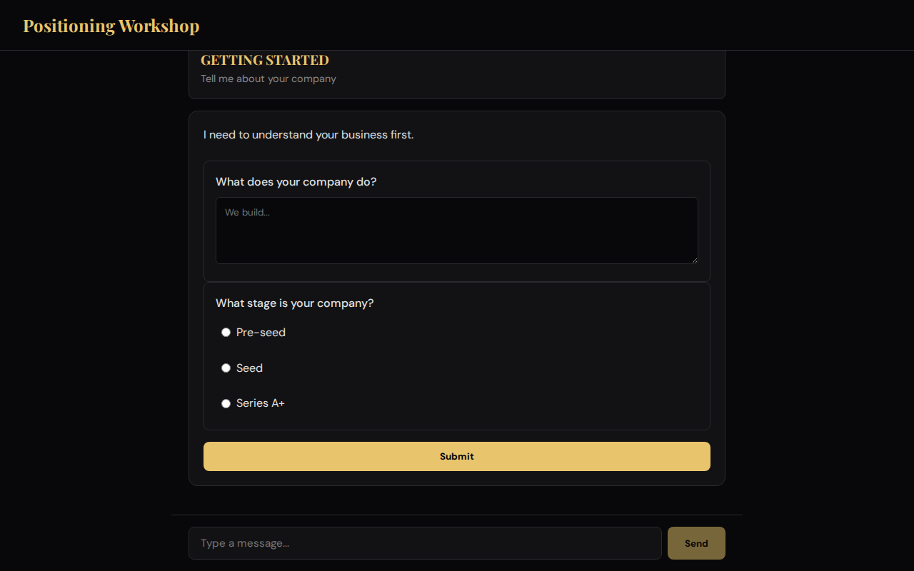
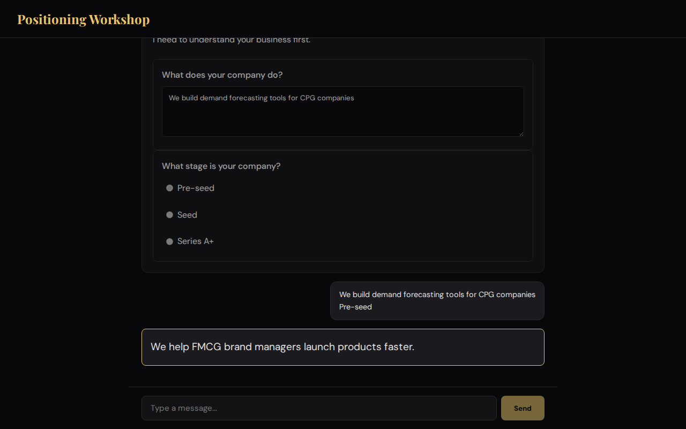
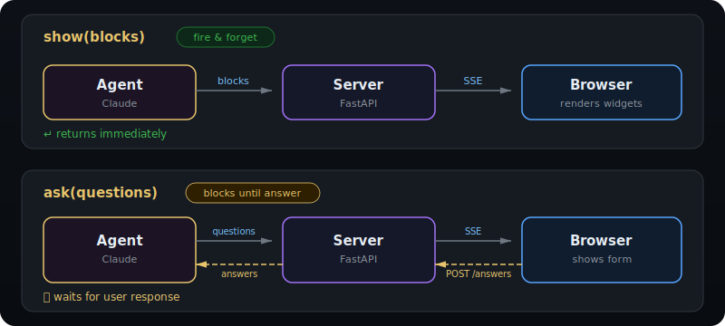
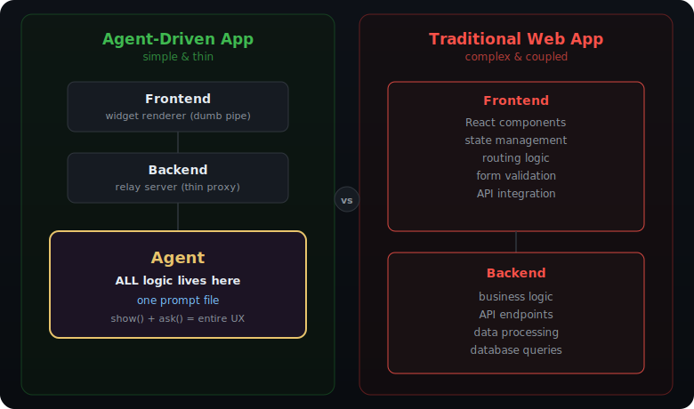
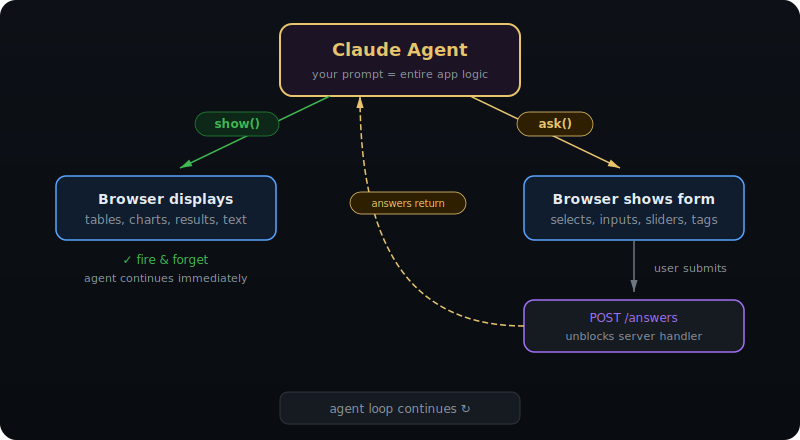
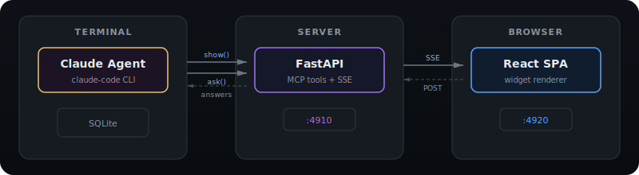
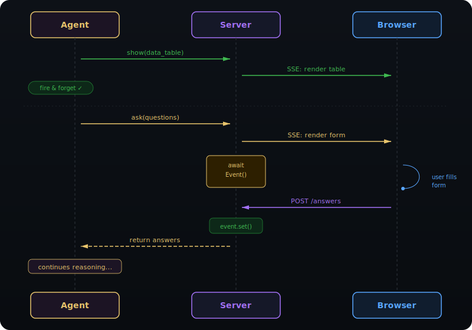
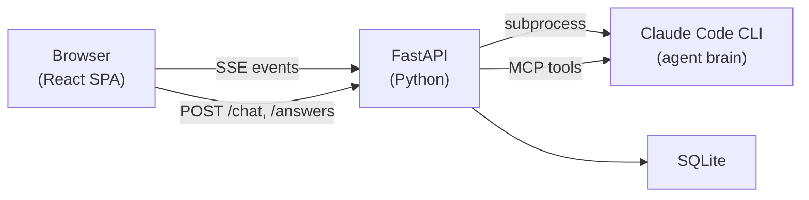

# Claude Prompt-to-App — Turn a Prompt into an Interactive Web App

[](https://github.com/msmorodinov/claude-prompt-to-app/actions/workflows/ci.yml)

> Two MCP tools. One prompt. A full interactive web app — powered by Claude.

Write a prompt, get a working web application. A Claude agent calls `show()` to display
rich widgets and `ask()` to collect user input — the browser renders everything and sends
answers back. No frontend logic needed — **the prompt IS the product**.

**Included example:** A positioning workshop where Claude leads founders through competitive
research and strategic questioning to produce a positioning statement.

<!-- GitHub About: Turn a prompt into a full interactive web app. Claude agent + two MCP tools → rich UI. -->
<!-- Topics: claude, claude-code, mcp, mcp-tools, prompt-to-app, ai-agent, interactive, web-app, react, fastapi, python, typescript, positioning, claude-agent -->

## Demo

<p align="center">
  
</p>

<p align="center">
  
</p>

<p align="center">
  
</p>

## Quick Start

```bash
make install    # Create venv, install Python + Node dependencies
make mock       # Start mock backend + frontend (no Claude needed)
```

Open http://localhost:4920 — type anything to start.

### Real Claude mode

Requires a [Claude Max subscription](https://claude.ai) (OAuth, no API key).

```bash
make install
make dev
```

Open http://localhost:4920 and start your positioning workshop.

## The Pattern: show + ask (two MCP tools)

Any Claude agent can become an interactive web app with just two MCP tools:

| Tool | Behavior | What it does |
|------|----------|-------------|
| `show(blocks)` | Fire-and-forget | Push display widgets to the browser |
| `ask(questions)` | Blocking | Send input widgets, wait for user response |

The browser is a "dumb renderer" — it shows whatever the agent sends and forwards user input back.
The agent controls the entire experience: what to display, what to ask, when to research, when to deliver.

This means you can build interactive programs **from a terminal** — no React knowledge needed for the logic.
Just write a prompt and call two tools.

<p align="center">
  
</p>

<p align="center">
  
</p>

<p align="center">
  
</p>

<p align="center">
  
</p>

<p align="center">
  
</p>

## Architecture



**The key pattern — async wait:**

1. Claude calls `ask(questions)` MCP tool
2. Tool handler sends questions to browser via SSE, then `await asyncio.Event()`
3. User fills the form, clicks Submit
4. Browser POSTs to `/answers` → `event.set()` unblocks the handler
5. Handler returns answers to Claude → agent loop continues

## The Skill: One Prompt

The entire workshop logic lives in a single system prompt ([`backend/prompt.py`](backend/prompt.py)). Claude decides what to research, what to ask, when to push back, and when to deliver results. The prompt defines the methodology — Claude interprets it freely.

## How It Works

The app has exactly **two MCP tools**:

| Tool | Behavior | Purpose |
|------|----------|---------|
| `show` | Fire-and-forget | Display content (tables, charts, results) |
| `ask` | Blocking (waits for user) | Ask questions via interactive forms |

Claude also uses built-in `WebSearch` and `WebFetch` for live competitor research.

### Event flow

```
Claude calls show(blocks)  →  SSE: assistant_message  →  Browser renders widgets
Claude calls ask(questions) →  SSE: ask_message         →  Browser shows form
                                                          User submits
                            ←  POST /answers             ←  Browser sends answers
Claude receives answers     →  continues reasoning...
```

## Widget Catalog

### Display widgets (11 types) — inside `show`

| Type | Use case |
|------|----------|
| `text` | Markdown commentary and analysis |
| `section_header` | Phase separation headers |
| `data_table` | Tabular data with highlights |
| `comparison` | Side-by-side before/after |
| `category_list` | Categorized lists with styles |
| `quote_highlight` | Key insight callouts |
| `metric_bars` | Scored metrics with bars |
| `copyable` | Copy-to-clipboard blocks |
| `progress` | Workshop progress indicator |
| `final_result` | Accented positioning statement |
| `timer` | Countdown ("don't overthink") |

### Input widgets (7 types) — inside `ask`

| Type | Use case |
|------|----------|
| `single_select` | Forced-choice questions |
| `multi_select` | Multiple selections |
| `free_text` | Open text input |
| `rank_priorities` | Drag-and-drop ranking |
| `slider_scale` | Scale 1–10 ratings |
| `matrix_2x2` | Effort vs impact grid |
| `tag_input` | Word association tags |

## Tech Stack

| Layer | Tech |
|-------|------|
| Backend | Python 3.11+, FastAPI, uvicorn, [Claude Agent SDK](https://github.com/anthropics/claude-agent-sdk) |
| Frontend | React 19, Vite, TypeScript |
| Database | SQLite (aiosqlite) |
| Agent | Claude Code CLI via subprocess |

## Project Structure

```
forge-simple/
├── backend/
│   ├── server.py        # FastAPI app, SSE, /answers
│   ├── agent.py         # Claude SDK client, agent lifecycle
│   ├── tools.py         # MCP tools: show + ask
│   ├── schemas.py       # JSON schemas for all widgets
│   ├── session.py       # Session state, SSE queue
│   ├── db.py            # SQLite persistence
│   └── prompt.py        # The one prompt (positioning methodology)
│
├── frontend/
│   └── src/
│       ├── components/
│       │   ├── display/  # 11 show widgets
│       │   └── input/    # 7 ask widgets
│       ├── hooks/        # useSSE, useChat
│       └── styles/
│
└── e2e/
    ├── fixtures/
    │   └── mock_server.py  # Mock backend for testing
    └── tests/
```

## Testing

```bash
make test            # Run all tests (frontend + backend)
make test-frontend   # Frontend only (91 tests)
make test-backend    # Backend only (16 tests)
make test-e2e        # E2E tests (requires mock server running)
```

## Build Your Own Claude App

Fork this repo and replace the prompt — everything else is reusable:

1. **Write a prompt** (`backend/prompt.py`) — define personality, methodology, tool usage
2. **Optionally add widgets** — or reuse the existing 18 widget types
3. **Run it** — `make mock` for testing, `make dev` with real Claude

### Examples

| Prompt idea | show widgets | ask widgets |
|-------------|-------------|-------------|
| User interview | quote_highlight, text | free_text, single_select |
| Code review | data_table, comparison | single_select, free_text |
| Business model canvas | category_list, copyable | tag_input, matrix_2x2 |
| Sprint retrospective | metric_bars, text | rank_priorities, free_text |

Same two tools. Same widget set. Different prompt → different product.

## License

[MIT](LICENSE)
